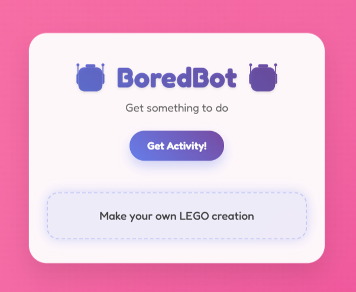

# 🤖 BoredBot

A fun and interactive web application that helps cure your boredom by suggesting random activities to do!

## 🌟 Features

- **Random Activity Generator**: Get personalized activity suggestions with a single click
- **Beautiful UI**: Modern glassmorphism design with smooth animations
- **Dynamic Theming**: Background changes based on time of day (morning, afternoon, evening)
- **Responsive Design**: Works perfectly on desktop and mobile devices
- **Interactive Animations**: Engaging hover effects, loading states, and transitions

## 🚀 Live Demo

Check out the live application: [BoredBot](https://kvothe1387.github.io/Bored-Bot/)

## 🛠️ Technologies Used

- **HTML5**: Semantic markup structure
- **CSS3**: Advanced styling with gradients, animations, and responsive design
- **Vanilla JavaScript**: Dynamic functionality and API interactions
- **Bored API**: External API for fetching random activities
- **Google Fonts**: Fredoka font family for enhanced typography

## 📱 Screenshots




## ⚡ Quick Start

1. Clone the repository:
   ```bash
   git clone https://github.com/kvothe1387/Bored-Bot.git
   ```

2. Navigate to the project directory:
   ```bash
   cd Bored-Bot
   ```

3. Open `index.html` in your web browser or use a local development server:
   ```bash
   # Using Python 3
   python -m http.server 8000
   
   # Using Node.js (if you have live-server installed)
   npx live-server
   ```

4. Visit `http://localhost:8000` in your browser

## 🎨 Design Features

### Visual Effects
- **Glassmorphism**: Frosted glass effect with backdrop blur
- **Gradient Backgrounds**: Beautiful color transitions
- **Floating Animation**: Subtle container movement
- **Hover Effects**: Interactive button animations
- **Loading States**: Smooth transition animations

### Dynamic Theming
The app automatically adjusts its color scheme based on the time of day:
- **Morning (6 AM - 12 PM)**: Blue/teal gradient
- **Afternoon (12 PM - 6 PM)**: Pink/magenta gradient  
- **Evening/Night (6 PM - 6 AM)**: Purple/blue gradient

## 🔧 API Integration

The app uses the [Bored API](https://www.boredapi.com/) to fetch random activities. The API returns activity data including:
- Activity description
- Activity type
- Number of participants
- Price range
- Accessibility level

## 📂 Project Structure

```
Bored-Bot/
├── index.html          # Main HTML file
├── index.css           # Stylesheet with animations and responsive design
├── index.js            # JavaScript functionality and API calls
└── README.md           # Project documentation
```

## 🤝 Contributing

Contributions are welcome! Here are some ways you can contribute:

1. **Fork the repository**
2. **Create a feature branch**: `git checkout -b feature-name`
3. **Make your changes** and test them
4. **Commit your changes**: `git commit -m 'Add some feature'`
5. **Push to the branch**: `git push origin feature-name`
6. **Submit a pull request**

### Ideas for Contributions
- Add activity filtering by type or participants
- Implement activity favorites/history
- Add social sharing functionality
- Create activity difficulty indicators
- Implement offline mode with cached activities

## 📄 License

This project is open source and available under the [MIT License](LICENSE).

## 🙏 Acknowledgments

- [Bored API](https://www.boredapi.com/) for providing the activity data
- [Google Fonts](https://fonts.google.com/) for the Fredoka font family
- [Scrimba](https://scrimba.com/) for hosting the API endpoint

## 👨‍💻 Author

- GitHub: [David McCullough](https://github.com/kvothe1387)
- LinkedIn: [David McCullough](https://www.linkedin.com/in/davidmcc-webdev/)
- Portfolio: [My Portfolio](https://davidmcc.netlify.app/)

---

**Cure your boredom, one click at a time! 🎯**